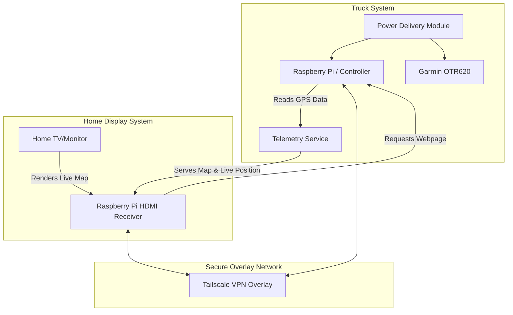

# Truck GPS Mount & Telemetry System (`truck-gps`)

A modular, parametric mount for the upper dash cubby in a **2022 Volvo VNL 860**, designed for a **Garmin OTR620** GPS, with integrated accessory shelves, real-time telemetry, and smart controller-based cooling/lighting.

This repository, formerly specific to the OTR620, has been restructured into a generic **`truck-gps`** project to host both mechanical (STL/CAD) files and software (Raspberry Pi/telemetry) code.

**Current status:** the repository contains the V3.1 mechanical fit prototype and earlier CAD sessions. The four v0.2 test pieces are currently being printed; physical fit results remain pending. A runnable simulation-first controller now lives in `src/pi/`: fan hysteresis, full-speed override, LED commands, sensor-fault handling and text/JSON status. Physical GPIO/PWM, live sensors, OLED, telemetry and revised cooling/power hardware remain unimplemented and untested.

Repository: [nuniesmith/truck-gps](https://github.com/nuniesmith/truck-gps).

---

## Documentation Index

- [README.md](README.md): Project overview, directory structure, system architecture, and electrical planning.
- [src/pi/README.md](src/pi/README.md): Run the controller simulation, tests, configuration and example service.
- [docs/pi-setup.md](docs/pi-setup.md): Selected fan, Pi review findings, software implementation and bench setup plan.
- [docs/todo.md](docs/todo.md): Master planning, task tracking, measurements, and physical test records.
- [docs/parts-list.md](docs/parts-list.md): Build inventory, exact faceplate fasteners, owned hardware and staged electronics list.
- [docs/fit-test-v0.2.md](docs/fit-test-v0.2.md): Worksheet for the four prints currently underway, review findings and v0.4 prerequisites.
- [docs/chats.md](docs/chats.md): Historical session logs (v0.1, v0.2, and v0.3) preserving earlier design rationale and prompts.
- [src/stl/v0.3/README.md](src/stl/v0.3/README.md): Current V3.1 print sequence, hardware, assembly and OpenSCAD export instructions.
- [docs/notes.md](docs/notes.md): Raw project ideas and planning notes.
- [docs/tomtom-api.md](docs/tomtom-api.md): TomTom Orbis Map, Routing, and Traffic API free tier and integration details.
- [docs/google-maps-api.md](docs/google-maps-api.md): Google Maps Platform free tier, Essentials, and Pro API configurations.

---

## Repository Structure

```
truck-gps/
├── README.md               # Main project file
├── docs/                   # Documentation, specifications, and notes
│   ├── todo.md             # Master task list and physical checklists
│   ├── chats.md            # Conversation archive from design sessions
│   ├── tomtom-api.md       # TomTom Orbis & legacy Maps pricing/specs
│   └── google-maps-api.md  # Google Maps pricing and capability reference
└── src/                    # Source code and physical designs
    ├── pi/                 # Runnable controller simulation; hardware and telemetry pending
    └── stl/                # 3D printer files (OpenSCAD & STLs grouped by design versions)
        ├── v0.1/           # First-generation design files
        ├── v0.2/           # Second-generation design files
        └── v0.3/           # V3.1 parametric mount & coupon test models
```

### Design sessions

| Directory | Origin | Role |
|---|---|---|
| [src/stl/v0.1](src/stl/v0.1) | First Claude session | Original insert and fit tests |
| [src/stl/v0.2](src/stl/v0.2) | Second Claude session | Rubber pads and accessory shelf |
| [src/stl/v0.3](src/stl/v0.3) | This ChatGPT session | V3.1 faceplate hardware, revised shelf and 12 STL files |

The session directory `v0.3` contains the CAD revision named **V3.1**; these are different naming schemes. Earlier `src/v0.x` paths and repository names in [the chat archive](docs/chats.md) are historical. Use the current paths above when locating files.

### First print checks

The four **v0.2** tests currently printing have their own [fit worksheet](docs/fit-test-v0.2.md), including nominal dimensions and what each part can establish. Record those results first. Then use [the V3.1 printing instructions](src/stl/v0.3/README.md#print-now-without-the-gps) for the newer external tabs, M2 hardware and accessory outlines; those features are not validated by v0.2. The GPS housing, rear ports, gasket overlap and power requirements remain provisional until verified on the actual unit.

---

## System Architecture: Telemetry & Home Map

The truck has a stable **Starlink Wi-Fi** network, allowing the in-cab system to connect to the internet in real time.



### Tracking Workflow:
1. **Telemetry & GPS Capture (planned):** Select a supported GNSS input. A live position interface from the OTR620 has not been verified; an external receiver may be needed.
2. **Tailscale Private Network:** Both the truck Raspberry Pi and the home Raspberry Pi are enrolled in a private **Tailscale** network. This eliminates public IP exposure and port-forwarding issues.
3. **Home Display:** A Raspberry Pi connected to a TV/monitor at home loads a local webpage hosted by the truck Raspberry Pi via its Tailscale IP address.
4. **Real-time Map:** The page displays a high-resolution map of Canada and the United States with a custom truck icon representing your live location.
5. **Historical Logs:** The system logs traveled distance (km/miles) and states/provinces/countries visited per calendar year.
6. **Live Traffic:** The map consumes real-time traffic alerts using **TomTom Orbis Traffic** or **Google Maps** APIs on their generous free tiers.

---

## Power Strategy: Single vs. Dual USB-C Input

The front of the mounting bracket will feature physical toggle switches/buttons allowing manual control over individual power lines:
- **Main Power** (Master cut-off)
- **GPS Power**
- **Blue LEDs Power**
- **Cooling Fan Auto / Boost** (the current control policy has no manual force-off mode)

We have evaluated two power routing topologies for the back of the bracket:

### Option A: Single USB-C Cable (Future candidate)
* **Description:** A single USB-C PD (Power Delivery) source powers the entire bracket. An internal buck converter regulates the input down to stable 5V lines.
* **Pros:**
  * Clean single-cable aesthetic behind the bracket.
  * Easy routing down the Volvo VNL dash.
  * Simplified physical plug-in sequence.
* **Cons:**
  * Requires robust internal step-down circuitry (e.g., converting 9V/12V PD to 5V @ 4A).
  * High-power charging (AirPods + GPS + Fan + Pi) could introduce electrical noise or heat.
  * Single point of failure for the entire system.

### Option B: Separate GPS and auxiliary supplies (Initial bring-up)
* **Description:** One USB-C cable runs directly to the Garmin GPS, while a second USB-C cable powers the Raspberry Pi and auxiliary components separately.
* **Pros:**
  * Separate supply paths for the Garmin and experimental accessories; a shared upstream source or ground can still couple faults.
  * Avoids a combined converter during initial tests; each output still needs appropriate regulation, protection and cabling.
  * If the Pi hangs or crashes, the GPS remains fully powered and functional.
* **Cons:**
  * Looks cluttered with two separate cables exiting the back of the bracket.
  * Uses up two USB power outlets in the truck's dashboard area.

---

## Selected controller: Raspberry Pi Zero 2 W

Use **Raspberry Pi Zero 2 W with Raspberry Pi OS Lite** as the host. The user selected a full Linux OS for SSH, Tailscale, telemetry and the home-map service while retaining low-level accessory control. A Pico is no longer the primary-controller plan.

I²C supports the selected OLED, 1-Wire supports the temperature sensors, and GPIO supports buttons and accessory control interfaces. Select a verified hardware PWM backend for fan speed; the old `RPi.GPIO.PWM()` example does not provide it. Keep fan control independent of network and display availability.

Allow for the board's micro-USB connectors, GPIO header, microSD access and 2.4 GHz Wi-Fi when designing the mount. [Raspberry Pi Zero 2 W specifications](https://www.raspberrypi.com/products/raspberry-pi-zero-2-w/)

Run [the controller simulation](src/pi/README.md) now, then follow [the implementation and first-boot plan](docs/pi-setup.md). The board/OS choice is settled; the exact GPIO backend, OLED, power hardware, GNSS input and mechanical layout still require selection and bench testing.

---

## Technical Specifications

### Garmin OTR620 Physical Baseline
* **Nominal Size:** 152.4 × 86.4 × 18.0 mm
* **Pocket Dimensions:** 153.8 × 87.8 × 19.0 mm
* **Mounting Type:** Secure gasketed front faceplate with 4x M2 × 6 mm screws and standard M2 nuts.
* **Operating Voltage:** Provisional branch allowance of 5 V up to 2 A, not a confirmed peak rating; verify device/adapter requirements.

### Accessory Mounts (V3.1 Shelf)
* **AirPods Pro 3 Mount:** Angled at 45° for visual access, designed around a Latercase cover. Can support a wired short right-angle USB-C cable or an embedded magnetic wireless charging puck.
* **PopSocket Mount:** Custom oval pocket designed around a MagSafe PopSocket base. Includes a recess for a 55mm OD / 43mm ID steel target ring for magnetic retention.

---

## Selected fan and thermal control

The selected fan is the **Noctua NF-A4x20 5V PWM**, four-pin. Its nominal body is 40 × 40 × 20 mm and the manufacturer lists 22 mm thickness with pads. That is a component envelope, not a finished pocket dimension. See the [verified specifications and connection table](docs/pi-setup.md#selected-fan-and-proposed-interface).

For v0.4, provide a removable mount with adjustable fit tolerance, cable access and airflow clearance. Keep ventilation separate from the speaker return duct. The existing approximately 29.8 mm rear cavity and 39.4 mm sound opening do not establish that the complete fan installation fits. Check actual hardware and the truck test results before fixing the mount dimensions.

Control goals are temperature-based speed, hysteresis, a manual override and explicit fault behavior. A 25 kHz hardware PWM implementation must be selected for the actual Pi and OS. The previous `RPi.GPIO.PWM()` example was software PWM and has been removed from active setup instructions. The old ambiguous fan wiring drawing is replaced by the [connection plan](docs/pi-setup.md#selected-fan-and-proposed-interface).

The 35–45°C ramp discussed earlier is only a bench starting proposal. Sensor faults must not be treated as 0°C. The simulation requests full cooling and reports a fault. The fan's physical boot/crash behavior still needs electrical verification. See [the complete review findings](docs/pi-setup.md#review-findings-to-resolve-in-implementation).

## Pi controller and status display

The selected host is a Pi Zero 2 W with Raspberry Pi OS Lite. The first software milestone implements simulated fan/LED control, sample parsing, fault policy, configuration and console status. Run `python3 -m truck_gps --format json` from `src/pi/` with Python 3.11+. Live sensor acquisition, GPIO/PWM adapters, buttons and OLED remain next steps; see [software instructions and tests](src/pi/README.md). The Pi controls accessories; the power-distribution hardware supplies them. Define a Linux shutdown and power-hold strategy before adding ignition or master-cutoff control.

An SSD1306 or SH1106 OLED remains planned. Select the exact module and verify its dimensions, driver, I²C address, supply/pull-ups, viewing angle and day/night readability. Its screen should show:

- Wi-Fi and Tailscale connection state with timeouts and an offline indication.
- GPS-compartment temperature, explicitly separate from Pi CPU temperature.
- Requested fan duty and measured RPM if tach feedback is installed.
- Actual controller/switch state, with unavailable power feedback labeled as unknown.

The former OLED snippet used fixed fan and switch values and CPU temperature, so it has been replaced by [implementation requirements](docs/pi-setup.md#software-status-under-srcpi). OLED or network failure must not block local cooling. Install Python dependencies in the application's virtual environment once the exact board/module stack is selected.

## v0.4 inputs

Finish and record the v0.2 fit tests, then check the v0.3 mounting tabs and M2 hardware separately. The v0.2 round PopGrip pocket does not validate the oval PopSocket. Freeze the Pi, fan, OLED, switches and cable envelopes before designing permanent openings. The next mechanical revision is planned under `src/stl/v0.4/`; no v0.4 files have been generated yet. [Detailed checklist](docs/pi-setup.md#v04-preparation-after-fit-tests)

---

## Next Planning Phases
1. **Mechanical Prototyping:** 3D print the V3.1 coupon tests and verify Volvo VNL cubby fit, M2 nut recesses, and Garmin housing dimensions.
2. **Bench Bring-up:** Follow [the Pi setup plan](docs/pi-setup.md); initially power the GPS and accessory electronics separately. Recalculate the future combined supply budget using the selected Pi and peripherals.
3. **Telemetry & Software PoC:**
   * Configure a Raspberry Pi Zero 2W with Tailscale and connect it to truck Starlink Wi-Fi.
   * Write a lightweight service in Python to process GPS NMEA data sentences.
   * Design a simple dashboard map using TomTom Orbis Web SDK / API.

