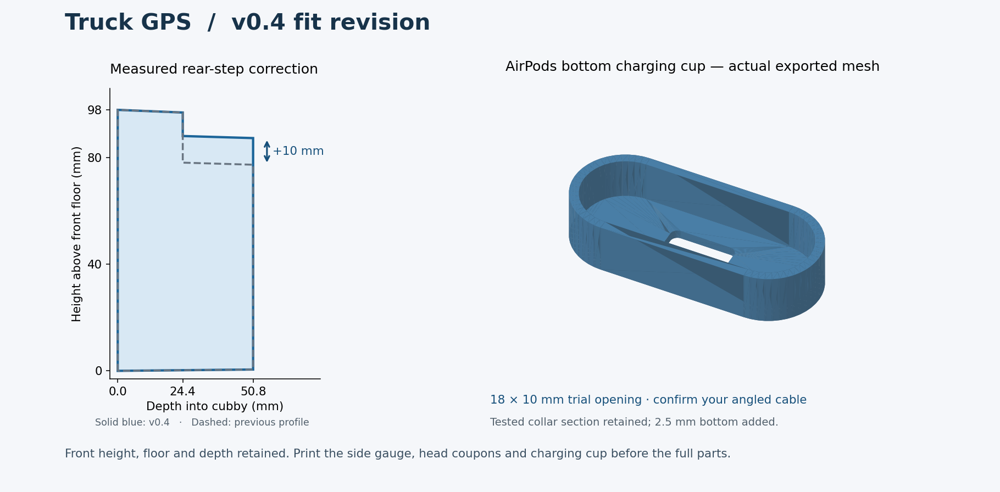

# v0.4 — measured fit revision

These files update the V3.1 source using the reported v0.2 test results. The rear step rises **10 mm**, as measured by the owner. The front opening stays **164.5 × 98.0 mm**, the depth stays **50.8 mm**, and the floor, taper and bolt positions are retained. Earlier model directories are preserved.



## Print these three small tests first

Print in millimetres at **100% scale**, in the supplied orientation. Use the same material/profile intended for the corresponding full part.

| Order | File | What to check |
|---|---|---|
| 1 | [side_gauge_plus10.stl](side_gauge_plus10.stl) | Rear lower roof/step is 10 mm higher. Keep the marked FRONT edge at the same cubby reference. Confirm both sides and seating around the rubber lip. |
| 2 | [bolt_head_fit_test.stl](bolt_head_fit_test.stl) | Six separate labeled blocks: **10.6, 10.8, 11.0, 11.4, 11.8, 12.2 mm** across flats. Choose the smallest pocket that fully seats the actual head without force and prevents rotation. All retain the successful **7 mm** shank passage. |
| 3 | [airpods_charge_test.stl](airpods_charge_test.stl) | Trial bottom cup for the AirPods with Latercase. Check snug fit, removal, port alignment and the actual USB-C plug/elbow through the bottom opening. |

The supplied full insert uses a **provisional 10.8 mm** head pocket, 0.5 mm larger than the tested v0.2 pocket. That is not a measured bolt-head size. If another coupon fits best, change `head_af` in the source and re-export the insert before the long print. If none fits, measure the actual head; enlarging beyond this range needs a wall/duct-clearance review. These shallow head coupons do not validate bolt length or the complete bearing stack.

The AirPods cup preserves the tested nominal **64.2 × 23.8 mm stadium opening**, **12 mm collar wall** and **2.5 mm walls**, and adds a **2.5 mm bottom**. Its rounded **18 × 10 mm** cable opening is a trial plug-body allowance. It is an opening for a cable, not a fixed USB-C receptacle. `ap_charge_w`, `ap_charge_d`, `ap_charge_x` and `ap_charge_z` adjust its size and alignment. Check the elbow and cable bend as well as the connector tip.

## Full parts

| File | Changes / use | Exported X × Y × Z envelope (mm) |
|---|---|---|
| [insert_trial_10p8.stl](insert_trial_10p8.stl) | Rear step +10 mm, trial head traps, retained padded GPS pocket and speaker duct | 176.5 × 98 × 55 |
| [shelf_wired_airpods.stl](shelf_wired_airpods.stl) | Snug bottom collar on the 45° shelf, broad AirPods front facing up/toward driver, bottom charging access; oval PopSocket seat retained | 164.5 × 132.763 × 97.853 |
| [faceplate.stl](faceplate.stl) | Retained V3.1 removable gasketed faceplate | 176.5 × 92 × 6.3 |

The faceplate still uses **four M2 × 6 mm screws and four plain M2 nuts**. Reuse the v0.3 nut-fit and bolt-cover coupons; their fit is not established by the v0.2 tests. External tabs extend the complete insert/faceplate width to **176.5 mm**; the successful v0.2 opening test did not check those tabs. GPS fit, bezel overlap, pads and rear cable clearance still require the actual device.

The shelf still shares the two lower dash bolts through its tongues/L-tabs. It reaches approximately **82 mm forward** and **74 mm below** the cubby floor: check the radio and controls below before printing it. The PopSocket steel-target recess remains provisional; this is storage only. The existing ball mount will be removed for installation. Remove the cubby rubber if it prevents seating; do not use the bolts to pull a binding print into shape.

All six supplied STLs fit the nominal **220 × 220 mm Ender 3 Neo bed**, including a calculated 10 mm brim allowance per side. Check the actual slicer footprint, bed clips, purge line and supports. The insert is supplied face up and the shelf upright. Review support under the insert step/tabs and the shelf tongues/angled collar; these checks do not replace slicing. No printer-specific G-code is included.

This revision provides wired AirPods access. The Pi Zero 2 W carrier, PWM fan mount, separate ventilation, OLED and switches remain for the later electronics revision.

## Source and export

[otr620_vnl_v0_4.scad](otr620_vnl_v0_4.scad) is the editable source. The default `assembly` target is a preview, not one printable object. Commands below reproduce the six deliverables with OpenSCAD 2021.01; preserve native binary export to avoid ASCII precision artifacts.

```sh
openscad --export-format binstl -D 'part="side_gauge"' -o side_gauge_plus10.stl otr620_vnl_v0_4.scad
openscad --export-format binstl -D 'part="bolt_head_coupon"' -o bolt_head_fit_test.stl otr620_vnl_v0_4.scad
openscad --export-format binstl -D 'part="airpods_charge_test"' -o airpods_charge_test.stl otr620_vnl_v0_4.scad
openscad --export-format binstl -D 'part="insert_v4"' -o insert_trial_10p8.stl otr620_vnl_v0_4.scad
openscad --export-format binstl -D 'part="shelf_v4"' -o shelf_wired_airpods.stl otr620_vnl_v0_4.scad
openscad --export-format binstl -D 'part="faceplate"' -o faceplate.stl otr620_vnl_v0_4.scad
```

## Checks performed

[mesh_checks.json](mesh_checks.json) records triangle counts, envelopes and SHA-256 checksums of these exact STLs. All have closed, consistently oriented mesh edges, positive volume and zero degenerate triangles. Each installed part/test cup/gauge is one connected component; the head coupon file intentionally contains six. Run `python3 validate_meshes.py` with NumPy installed to repeat those checks.

[geometry_checks.json](geometry_checks.json) records empty intersections for insert/shelf, insert/faceplate, the approximate AirPods stand-in and a straight charging-access prism. Intended mating surfaces are slightly separated only in the verification targets. These checks do not establish real cable-elbow clearance, print strength or physical fit. A 0.01 mm internal overlap at the retained front-tab joins removes a degenerate export triangle without changing the front outline or fastener positions.

See the [recorded fit results](https://github.com/nuniesmith/truck-gps/blob/main/docs/fit-test-v0.2.md), [parts list](https://github.com/nuniesmith/truck-gps/blob/main/docs/parts-list.md) and [remaining tasks](https://github.com/nuniesmith/truck-gps/blob/main/docs/todo.md) in the repository. The updated records are also included in the v0.4 pull request until it is merged.
