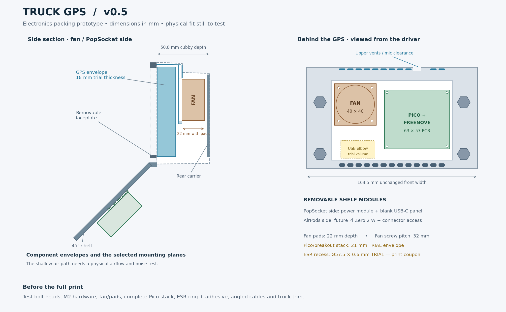

> **Fit dimensions superseded:** use the [v0.6 caliper fit checkpoint](../v0.6/README.md) next. Confirmed inside dimensions are 170 mm wide, 98 mm front height and 80 mm below the rear notch. This revision's full insert, carrier and packing test exceed the corrected rear clearance; do not print them as the current fit. Original documentation below is historical.

# v0.5 — electronics and modular shelf prototype

**Status: fit-test prototype, not the final long-print release.** The actual GPS, complete Pico/breakout stack, ESR ring and cable envelopes still need measurement. Editable source: [otr620_vnl_v0_5.scad](otr620_vnl_v0_5.scad). [Hardware decisions](../../../docs/hardware-v0.5.md) · [Parts list](../../../docs/parts-list.md)

This revision preserves the v0.4 front opening, measured rear-step rise, bolt-shank bores and successful AirPods collar section. It adds a Noctua **NF-A4x20 5V PWM** mount, a removable Freenove/Pico carrier, top vents, a trial ESR recess, an optional control pod and two removable shelf modules. The future computer is **Raspberry Pi Zero 2 W**, distinct from the Pico microcontroller.



## Print queue

Print at 100% in millimetres. These are tests, not an instruction to print all 22 files immediately.

| Order | Files | What to establish |
|---|---|---|
| 1 | `side_gauge_plus10.stl`, `bolt_head_fit_test.stl` | Confirm the measured rear rise; choose the smallest head pocket that seats the actual bolt without force. Retained unchanged from v0.4 |
| 2 | `airpods_charge_test.stl` | Confirm the tested collar with the actual angled charging cable through the bottom opening. Retained from v0.4 |
| 3 | `nut_test.stl`, `bolt_cover_test.stl` | Fit the ordered M2 nuts/screws and verify the 6 mm faceplate screw stack. Nut choices are 4.1 / 4.3 / 4.5 mm across flats, left to right |
| 4 | `fan_mount_test.stl`, `rear_carrier.stl` | Check fan hole pattern, pad stack, mounting hardware, Freenove holes and the installed Pico/header height |
| 5 | `ring_depth_test.stl` | Four **57.5 mm diameter trial recesses**, labelled 0.4 / 0.6 / 0.8 / 1.0 mm deep. Test with the adhesive included; do not glue the ring into a coupon |
| 6 | `fan_plenum_print_test.stl` | Cropped fan plenum/header in the insert's print direction; tune bridges and prove support removal before the long insert. This is not a complete airflow fixture |
| 7 | `packing_test.stl`, `control_outline_test.stl` | Check electronics packing and left-side trim space. These are alignment/layout gauges, not a substitute for the actual assembly |
| Later | Main insert, faceplate, shelf and optional module bodies/covers | Only after affected tests pass and the Garmin's fit and cable route are confirmed |

Use `packing_test` together with the known front/back cubby references. Its flat base represents the rear plane; towers extend toward the GPS. The fan tower includes its rear gap (26.8 mm total), and the Pico tower represents the provisional 29.4 mm reach from the rear plane. Neither tower is a functional electronics holder. Remove the existing ball mount for the final installation. If the rubber lip prevents seating, remove or adjust it; do not pull a distorted print into shape with bolts.

## Printable parts and OpenSCAD selectors

| STL filename | `part` selector | Role |
|---|---|---|
| `insert_v5.stl` | `insert_v5` | Main body, fan frame/plenum, top ventilation and control-pod mounting tabs |
| `faceplate_v5.stl` | `faceplate_v5` | Removable gasketed bezel, M2 × 6 hardware, matching upper vents |
| `shelf_v5.stl` | `shelf_v5` | AirPods collar, ESR trial recess and module mounting points |
| `rear_carrier.stl` | `rear_carrier` | Freenove standoffs, GPS cable opening, LED and cable tie points |
| `control_pod.stl` | `control_pod` | Optional left-side controls housing |
| `control_panel.stl` | `control_panel` | Replaceable blank for a selected screen/switch layout |
| `zero_tray.stl`, `zero_cover.stl` | `zero_tray`, `zero_cover` | Reserved future Zero 2 W module with board posts and connector windows |
| `power_tray.stl`, `power_cover.stl` | `power_tray`, `power_cover` | Universal tie-grid module; power circuitry not selected |
| `power_inlet_panel.stl` | `power_inlet_panel` | Replaceable blank for the eventual USB-C inlet/module |
| `led_carrier.stl` | `led_carrier` | Two nominal 3 mm LEDs; tie to the rear carrier after checking placement |
| `fan_plenum_print_test.stl` | `fan_plenum_print_test` | Short print to assess the new internal bridges and removable supports |
| `fan_mount_test.stl` | `fan_mount_test` | Fan screw and pad-stack test |
| `ring_depth_test.stl` | `ring_depth_test` | Four ESR recess depth tests |
| `packing_test.stl` | `packing_test` | Fan/Pico packing envelope gauge |
| `control_outline_test.stl` | `control_outline_test` | Thin control-pod trim-space gauge |
| `nut_test.stl`, `bolt_cover_test.stl` | `nut_test`, `bolt_cover_test` | M2 faceplate hardware tests |
| `side_gauge_plus10.stl` | `side_gauge` | Retained v0.4 rear +10 mm gauge |
| `bolt_head_fit_test.stl` | `bolt_head_coupon` | Retained six head-size tests |
| `airpods_charge_test.stl` | `airpods_charge_test` | Retained cased-AirPods charging-hole test |

The source is standalone. Legacy v2–v4 helpers remain for traceability; active v0.5 modules and dispatch are at the end. `part="assembly"` is a non-printing preview containing dimensional stand-ins. The top-bar, cubby, GPS and unselected electronics dimensions are assumptions except where recorded as measured.

## Dimensions that must be chosen before long prints

| Parameter | Supplied value | Basis |
|---|---:|---|
| `rear_step_raise` | 10 mm | User measured; front geometry unchanged |
| `head_af` | **10.8 mm trial** | v0.2 head was too tight; choose from the six coupons |
| `bolt_d` | 7 mm | User reports the shank fits |
| `gps_t` | 18 mm | Actual device not yet available |
| `bezel_overlap` | 1.2 mm | Must bear on housing, not glass |
| `esr_recess_d` | **57.5 mm trial** | Nominal retail diameter plus allowance; actual ring unmeasured |
| `esr_recess_depth` | **0.6 mm trial** | Select using actual ring plus adhesive |
| `fnk_stack` | **21 mm trial** | Complete mounted Pico/breakout stack not measured |
| `ap_charge_w`, `ap_charge_d` | 18 × 10 mm | Provisional angled cable clearance |

Changing `fnk_stack` changes the check envelope, not the physical cubby depth. If the actual assembly is too tall, revise its location or carrier; do not reduce the check value to hide an interference. A round 57.5 mm recess allows an ESR ring without assuming an inner diameter, but the selected depth still determines whether it sits flush. Retention strength and adhesive suitability need a physical pull test.

## Mechanical layout and limits

The front body remains **164.5 × 98 mm**. The retained faceplate spans **176.5 mm** over its mounting tabs. The optional controls pod extends the assembled width to about **212.5 mm**, but prints separately. It projects about 24 mm forward of the original front plane, plus screw heads. Its lid remains blank until the screen and switch bodies are selected. It has a rear wire opening; the final harness route into/behind the cubby must be checked with those modules and may require a separate protected pass-through.

The fan occupies the left rear bay and the Freenove/Pico the right. The GPS's nominal mounting-socket relief is retained. The 30 × 16 mm rear cable opening and a trial right-angle-plug keepout are provided. Real plug orientation, bend radius and the actual speaker/power-button positions remain to confirm.

The fan frame uses a 37 mm opening and 32 mm hole spacing. Install the fan with airflow **toward the GPS-side plenum**, then upward through the header. The shallow riser and small top slots may restrict cooling; [thermal and acoustic tests are required](../../../docs/hardware-v0.5.md#airflow-and-lighting). The microphone channel is separate at the nominal location. Do not treat the shared lower speaker/intake opening as an acoustic isolation design.

The Zero and power modules mount behind the 45° shelf. Nominal module covers stay above its lower edge; screw heads and plugged-in cables need their own clearance check. The full shelf and populated accessories may obstruct the radio below—use the packing preview/profile and truck test before final printing. No truck-trim collision certification is implied.

## Hardware and assembly

See [the bill of materials](../../../docs/parts-list.md) before buying. Faceplate M2 × 6 screws are not interchangeable with longer carrier/module screws.

1. Fit the existing dash bolts and rear washers/nuts. The shelf still shares the lower two bolts through its tongues/L-tabs.
2. Install the fan before the GPS. Trial hardware is four **M2 × 25** screws, small washers and plain nuts. Heads must fit the 4.2 mm access bores. Test the 22 mm padded stack with the fan coupon; the screw bearing seat is 1 mm ahead of the fan face. Do not over-compress pads or leave a screw touching the carrier.
3. Insert four plain M2 nuts at the front of the body's rear carrier bosses. The rear carrier uses **M2 × 8** screws with heads no larger than 4.4 mm diameter and **1.7 mm high** so they stay recessed. Tighten gently. The carrier is accessed with the insert removed from the cubby.
4. Mount the Freenove board using four **M2 × 10** screws into the carrier's rear nut pockets. The nominal stack is 1.6 mm PCB + 6 mm standoff + 2.4 mm carrier. Verify underside component and solder clearance. Do not crush the PCB or allow metal hardware to touch traces; add appropriate insulation or revise the stack if needed.
5. Fit the padded GPS after confirming all rear features and cable slack. Fit the faceplate with its four M2 × 6 screws and the tested nuts. The original 1.2 × 0.6 mm gasket groove remains; cure gasket maker away from the device. Do not clamp the display glass.
6. The optional control pod uses **two additional M2 × 6** screws into separate insert tabs. Four **M2 × 20** screws and nuts retain its blank lid. These do not share the faceplate screws.
7. Each shelf module uses four **M2 × 25** screws through its cover/body into plain nuts recessed into the shelf front. Load these nuts before assembling modules. The future Zero board uses four M2 × 8 screws and nuts in its tray, with suitable small insulating washers if required after checking the stack. The power inlet blank uses two M2 × 6 screws and nuts.
8. Add insulated ties for the LED carrier, sensor lead and cables. Keep all wiring out of the fan rotor. The empty power tray does not provide regulation, USB-C negotiation or load protection.

All screw lengths here are **nominal CAD stacks**, pending actual hardware tests. The ordered faceplate screws are confirmed as a user choice, not physically checked by this revision.

## Printing and validation

The provided STL orientations place each part on the bed. All have nominal XY room on a 220 × 220 mm bed with 10 mm brim allowance per side; slicer clips, skirts and support footprint still need inspection. Main insert: rear down/front up; the fan plenum introduces additional internal overhangs. Shelf: upright as exported, with supports under tongues and other slicer-identified overhangs. Controller/power/Zero bodies print on their back/floor; lids and coupons print flat. Nut-pocket bridges and recessed screw seats may need tuning. **The old v0.2 claim that only one strip needs support does not apply to v0.5.** Remove all support from air paths and screw entries.

Use a test material/profile first. Select the final dashboard material against actual installed temperatures and the Ender 3 Neo's capabilities. Do not assume a successful room-temperature fit establishes hot-cab durability.

`mesh_checks.json` records closed oriented edges, degenerate-triangle checks, component counts, volumes and nominal bed bounds. `geometry_checks.json` records CAD interference checks against the named dimensional stand-ins. These checks do not prove real fit, thermal performance, structural strength, connector accessibility or print success. `validate_meshes.py` requires Python and NumPy. `export_models.py` uses OpenSCAD 2021.01 or a compatible version and writes native binary STLs.

```sh
python3 export_models.py
python3 validate_meshes.py
openscad --export-format binstl -D 'part="shelf_v5"' \
  -D 'esr_recess_depth=0.8' -o shelf_custom.stl otr620_vnl_v0_5.scad
```

Use a separate output folder or remove custom STLs before running the supplied validator; its expected component counts apply to the named release files. A changed head pocket, ring depth or other parameter needs a fresh export and validation of the affected parts.
