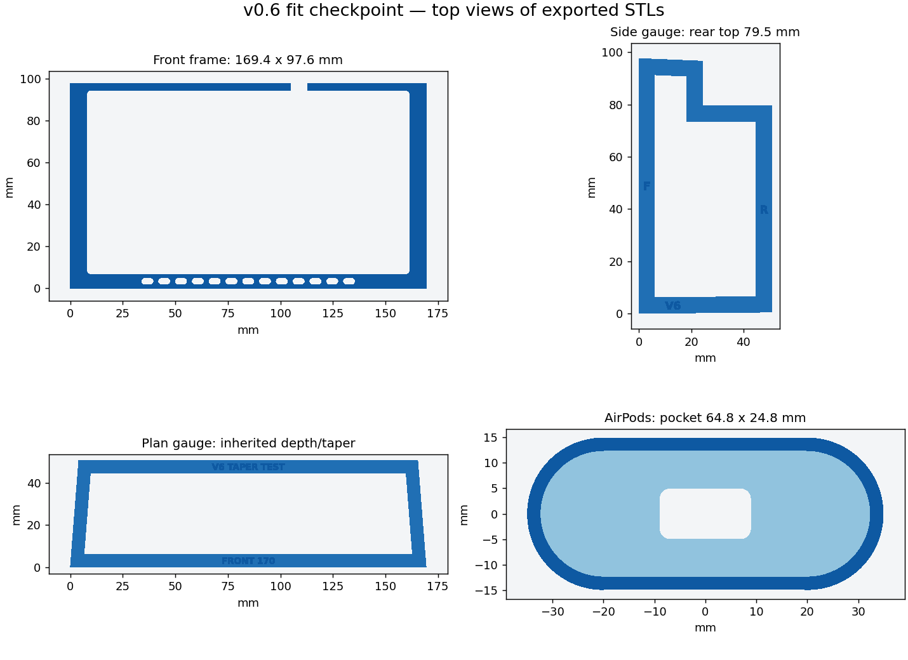

# v0.6 — caliper fit checkpoint

**Print these four test pieces next. This is not a complete enclosure revision.**
The confirmed inside dimensions supersede the v0.4/v0.5 rear +10 mm correction.
Do not print the v0.5 full insert, carrier or packing test for the newly measured cubby.
The existing electronics layout needs a separate revision after these gauges fit.



## Confirmed user measurements

Recorded 2026-09-27 (America/New_York), from the caliper sketch and follow-up replies.

| Feature | Measurement | Coupon geometry |
|---|---:|---:|
| Clear inside front width | 170 mm | 169.4 mm, 0.3 mm clearance each side |
| Front opening height | 98 mm | 97.6 mm, 0.4 mm top clearance |
| Height below rear notch | 80 mm | Rear top 79.5 mm above front-floor datum |
| AirPods + Latercase width | 64 mm | Pocket width 64.8 mm |
| AirPods + Latercase thickness | 24 mm | Pocket thickness 24.8 mm |
| AirPods + Latercase height | 49 mm | Reference for next shelf layout; collar height stays 12 mm |

The notebook's 80 mm label is a height, not depth. The user explicitly confirmed
170 mm is the inside width. These are reported measurements, not measurements
independently taken by the CAD author.

The old width input was 165.1 mm, giving a 164.5 mm printed frame. The new frame
is 4.9 mm wider. Do not scale the old STLs in the slicer: that would change the
GPS pocket, bolt holes and component footprints too.

## Print and test

Print at **100% scale**, in the supplied flat orientation. Each piece fits a
220 x 220 mm bed with a nominal 10 mm brim allowance per side. No designed
unsupported roofs occur in these coupons; inspect your slicer preview.

1. **front_frame.stl** — 169.4 x 97.6 x 4 mm. Check seating across the full
   opening without forcing. Its GPS pocket is the inherited nominal
   153.8 x 87.8 mm with 2 mm corners, microphone notch and lower grille.
   This checks the cubby face, not the actual GPS, faceplate screws or top vents.
2. **side_gauge.stl** — 50.8 mm deep x 97.6 mm high, 3 mm thick plus labels.
   The **F** edge faces the driver; **R** goes to the back. Seat the bottom on
   the same floor/liner datum used for the measurement. The notch starts
   24.4 mm behind the front; the rear top is flat at 79.5 mm. Check each side
   of the cubby independently, including the rubber lip. Record whether the
   liner is in or out; do not pull a binding gauge into place with bolts.
3. **plan_gauge.stl** — checks front width, 50.8 mm depth and the inherited
   4 mm-per-side taper (161.4 mm wide at the back). FRONT faces the driver.
   This taper is still a photo-based assumption; report any side interference.
4. **airpods_charge_test.stl** — enlarged 64.8 x 24.8 mm pocket, 12 mm collar,
   2.5 mm floor. Compare against the previously snug collar. Test retention,
   removal and your actual angled cable through the provisional 18 x 10 mm
   bottom opening. A physical pass is needed: the caliper maximum may occur
   above the section gripped by this shallow collar.

The 25.4 mm bar depth, 50.8 mm total depth, 1 mm upper-roof drop and 0.5 mm
rear-floor rise are inherited assumptions, not new measurements. Unlike v0.5,
the rear ceiling in this test is flat: the single confirmed 80 mm height does
not establish an underside slope. The gauge is intended to resolve this fit.

## Electronics review

The old layout does not fit the new height as drawn:

| v0.5 feature | Highest Y above front floor | Comparison with 80 mm rear clearance |
|---|---:|---|
| Fan body/pads | 82.0 mm | 2.0 mm too high |
| Rear carrier rectangle | 86.2 mm | 6.2 mm too high |
| Upper carrier boss envelope | 86.0 mm | 6.0 mm too high |
| Freenove PCB outline | 76.0 mm | Outline alone is below ceiling; mounting/wires still need rework |

The fan remains 40 x 40 x 20 mm (22 mm with pads), four-pin **5 V PWM**.
The control architecture remains Pico 2 WH/Freenove first, Pi Zero 2 W later.
A possible next layout lowers the fan center from Y=62 to Y=56 and the PCB
origin from Y=19 to Y=12; these are proposals only, not validated mounts.
The carrier, bosses, plenum, wiring and shell must be redesigned together and
checked against the actual stepped cubby envelope. Nothing in this checkpoint
claims that the complete assembly or airflow is validated.

## Reproduce

```sh
python export_models.py
python validate_meshes.py
```

OpenSCAD is required for exports and NumPy for validation. `mesh_checks.json`
records watertight oriented edges, triangle validity, connected components and
bed bounds. It does not certify strength, cooling, physical fit or GPS retention.
`fit_check.scad` is standalone; it deliberately provides no full insert export.
